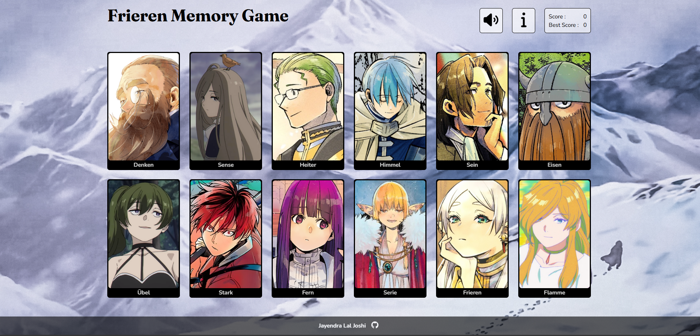

# Memory-Card

A responsive memory card game inspired by the popular anime *Frieren*.

## About This Project

This project was built as part of [The Odin Project](https://www.theodinproject.com/lessons/node-path-react-new-memory-card) React curriculum.

## What I Learned

Through this project, I learned to use `useEffect` effectively for fetching data from external sources such as APIs. I also developed a stronger understanding of `useRef` for persisting objects across renders, improved my skills with `useState` and props, and gained a deeper appreciation for building smaller, reusable components.

## Technologies and Tools Used

- HTML5
- CSS3
- JavaScript (ES6+)
- React
- Vite
- Git
- Vercel
- Font Awesome
- AniList GraphQL API

## Getting Started

1. Clone the repository
2. Install dependencies:
   - `npm install`
3. Start the development server:
   - `npm run dev`

## Live Demo

- Vercel: https://memory-card-nu-sable.vercel.app/

## Screenshot

## Resources

### Images
- https://wallhaven.cc/w/jxvl8p

### Icons
- https://fontawesome.com/icons/github?f=brands&s=solid
- https://fontawesome.com/icons/info?f=classic&s=solid
- https://fontawesome.com/icons/volume?f=classic&s=solid
- https://fontawesome.com/icons/volume-off?f=classic&s=solid

### Favicon
- https://unsplash.com/photos/silver-and-diamond-studded-cross-pendant-rGzUMs-QsCM

### Fonts
- Nunito & Fraunces  
  https://fonts.googleapis.com/css2?family=Nunito:wght@400;600;700&family=Fraunces:opsz,wght@9..144,400;9..144,600;9..144,700&display=swap

### Sounds
- https://youtu.be/LQHMy3J1ZsY?si=7r9W4OtrmAgbteNM
- https://freesound.org/people/egomassive/sounds/536782/
- https://pixabay.com/sound-effects/film-special-effects-click-buttons-ui-menu-sounds-effects-button-6-203600/